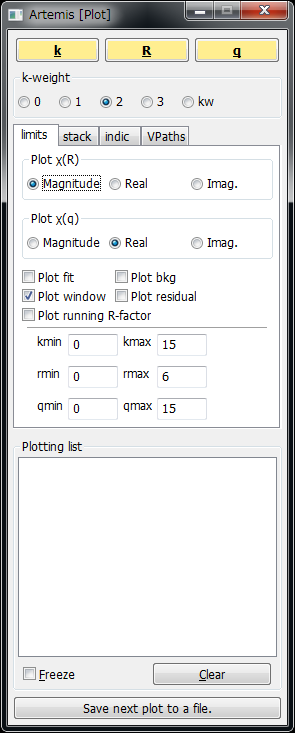

.. include:: <isogrk3.txt>
.. |angstrom| unicode:: U+0212B .. Angstrom

Artemis による XAFS データ処理（入門編）
========================================

.. note::

   :doc:`athena` から始めて下さい．

Artemis とは
------------

Artemis は Athena で解析して抽出した EXAFS スペクトルに対して，多重散乱理論に基づく XAFS の理論計算ソフト "FEFF" によって求められた Path (それぞれの散乱経路に対応した EXAFS 振動) をフィッティングすることで，配位数，原子間距離などを見積もることを目的としたソフトウェアである．

FEFF とは
---------

`FEFF <http://monalisa.phys.washington.edu/>`_ は University of Washington の Prof. J. J. Rehr のグループにより開発されている多重散乱理論に基づく XAFS の理論計算ソフトである．

また，Athena や Artemis などを作っている Bruce Ravel 氏やそのコアのプログラムである Ifeffit などを作っている Matthew Newville 氏は Rehr のグループの出身者である．

FEFF version 6L は無償で配布されており，Athena, Artemis をインストールする際に同梱されているので，通常のカーブフィッティングは十分行える．FEFF は現在 FEFF 9 まで更新されており，FEFF 6 以降を使うにはライセンス料が必要．

現在，FEFF 8 系列の FEFF8.5L がフリー版として公開されており，将来的に Artemis に統合される予定である．

EXAFS の理論式
--------------

EXAFS の理論式を示す． EXAFS 振動 :math:`\chi(k)` は，以下のように書くことができることが知られている．（但し，電子の平均自由行程についての項は除いている）

.. math::
   
   \chi(k) = S_0^2 \sum_j\frac{N_j F_j(k) \exp(-2k^2\sigma_j^2)}{k R_j^2} \sin(2kR_j+\phi_j(k))

:math:`\chi(k)`
    EXAFS 振動
:math:`S_0^2`
    多体効果による減衰因子
:math:`N_j`
    j 番目の散乱原子の個数
:math:`F_j(k)`
    **j 番目の散乱原子の後方散乱因子** （ある波数 k のエネルギーの光電子が散乱原子に向かってきたときに，どれくらいの割合で後ろに散乱されるか）
:math:`\sigma_j^2`
    j 番目の散乱原子の Debye-Wallar 因子（位置の揺らぎの大きさ）
:math:`R_j`
    j 番目の散乱原子と吸収原子の原子間距離
:math:`\phi_j(k)`
    **j 番目の散乱原子と吸収原子による位相変化** （ある波数 k のエネルギーの光電子が散乱原子に向かってきて散乱され，また吸収原子に戻ってくる際に，光電子の波の位相がどれくらい変わるか）

Artemis による EXAFS カーブフィッティングの大まかな流れ
-------------------------------------------------------

1. Atoms による FEFF 入力ファイルの生成
2. FEFF による Path の計算
3. 実験データへの Path の関連づけ
4. フィッティング変数の初期値や定義の設定
5. フーリエ変換パラメータ，フィッティング範囲の設定
6. フィッティング

.. warning::

   本チュートリアルでは，ある結晶構造を有すると期待される測定データの解析を例に挙げています．しかし，(E)XAFS は結晶性試料だけではなく，（原理的には）周期構造を有さない，様々な試料に対して適用可能です．例えば，ガラスなどの非晶質試料，溶液中の錯体などです．
   しかし，本チュートリアルでは，一通り，EXAFS カーブフィッティングにより何ができるかを「体感」することを優先しています．(E)XAFS は周期構造を有さない対象に有効，な場合もあるということに注意してください．

Artemis の起動
--------------

操作
~~~~

1. デスクトップ上の Artemis あるいはスタートメニューの Demeter with strawberry perl から Artemis を選択して Athena を起動する

   Artemis メインウィンドウ

   Artemis プロットウィンドウ

測定データの読み込み
--------------------

操作
~~~~

1. メニューバーの "File" から "Open project or data" をクリック
2. Athena 編で保存した \*.prj を選択して，Open をクリック

   Athena プロジェクトファイルからのデータの読み込み

読み込むと以下の読み込みオプションウィンドウとプロットウィンドウが表示される．

   読み込みオプション

   読み込まれたデータの表示

読み込みオプションとして，以下の項目がある．

Plot as
    グラフウィンドウのプロット内容を指定する（確認用）
Take parameters from
    解析パラメータをどのよう指定するか．通常は Project file (Athena で保存したときのパラメータ) でよい

操作
~~~~

1. Cufoil.dat を選択して Import selected data をクリック

   Artemis に読み込まれたデータ（データウィンドウ）

EXAFS スペクトルのプロット
--------------------------

データを読み込んだ時にできるデータウィンドウ左上の Plot this data set as のボタンをクリックすると，それぞれ以下に対応したスペクトルが表示される．

k123
    それぞれ :math:`k^1`, :math:`k^2`, :math:`k^3` がかけられた :math:`k^n \chi(k)` の EXAFS 振動が適当にスケールされて表示される

操作
~~~~

1. データウィンドウ左上の k123 をクリック

   k123 のプロット

R123
    それぞれ :math:`k^1`, :math:`k^2`, :math:`k^3` がかけられた :math:`k^n \chi(k)` のフーリエ変換後の EXAFS スペクトルが適当にスケールされて表示される

操作
~~~~

1. データウィンドウ左上の R123 をクリック

   R123 のプロット

Rmr
    プロットウィンドウで k-weight に選択されている :math:`k^n \chi(k)` のフーリエ変換後の EXAFS スペクトルとその実部が表示される

操作
~~~~

1. データウィンドウ左上の Rmr をクリック

   Rmr のプロット

Rk
    Rmr に追加して，フーリエ変換前の EXAFS 振動も表示される

操作
~~~~

1. データウィンドウ左上の Rk をクリック

   Rk のプロット

kq
    Fourier transform parameters の rmin, rmax で設定されている範囲が逆フーリエ変換されたスペクトル q とフーリエ変換前の EXAFS スペクトル k が重ねて表示される

操作
~~~~

1. データウィンドウ左上の kq をクリック

   kq のプロット

データウィンドウのパラメータ
----------------------------

Fourier transform parameters
    Athena のパラメータと同じ
Fitting k weights
    カーブフィッティングを行う場合に k の何乗の EXAFS スペクトルに対してフィッティングを行うか
Include in fit
    フィッティングを行うかどうか（複数のデータを読み込んでいるときに選択）
Plot after fit
    フィッティングを行った後にプロットするかどうか
Fit background
    フィッティングする際に Athena で引いたバックグラウンド関数を再度変数として扱ってフィッティングするかどうか
:math:`\epsilon(k)`
    実験誤差の設定（今回は使わない）
Plot with phase correction
    位相シフトの補正を行うかどうか （今回は使わない）

Atoms による FEFF 入力ファイルの生成
------------------------------------

ATOMS とは，Bruce Ravel 氏が作成した結晶構造パラメータから FEFF の入力ファイルを作成するためのユーティリティファイルである．

操作
~~~~

1. メインウィンドウの Feff calculations の Add を右クリック
2. Open a blank Atoms window を選択して OK

   Feff calculations

   Recent Feff or crystal data file

Atoms ウィンドウが表示される．

   Atoms ウィンドウ

まずは銅箔のフィッティングを行うために銅の結晶構造を入力し，Atoms を実行する．

操作
~~~~

1. Space group に "f m 3 m" と入力する
2. Lattice Constants の A に 3.61，\ :math:`\alpha` に 90 を入力する
3. 下の原子配置の場所の1行目の Core にチェック，EL に Cu，それぞれ X, Y, Z には 0，Tag に Cu1 を入力する
4. Atoms ウィンドウ上部の "Run Atoms" のアイコンをクリックする

   Atoms に銅の結晶構造パラメータを入力

   Atoms が生成した FEFF の入力ファイル

FEFF 入力ファイルの内容
-----------------------

詳しくは説明しないが，FEFF の入力ファイルには以下の様な項目がある．

# から始まる行
    「コメント」（FEFF の入力としては無視される）
TITLE
    FEFF の出力ファイルに書き出される行
HOLE
    Core hole の設定（1つめの数字はそれぞれ 1 (K-edge), 2 (L\ :sub:`1`\ -edge), 3 (L\ :sub:`2`\ -edge), 4 (L\ :sub:`3`\ -edge) に対応している．）
CONTROL
    計算内容の制御
PRINT
    計算結果の出力の制御
RMAX
    計算の際に考慮する中心原子からの距離
POTENTIALS
    各原子のポテンシャルの設定
ATOMS
    原子配置のリスト

詳しくは，\ `FEFF 8.2 日本語マニュアル <http://pfwww.kek.jp/jxs/feff82j.pdf>`_\ を参照のこと．（もちろん，`本家のマニュアル <http://monalisa.phys.washington.edu/feff/Docs/feff6/feff6.html>`_\ でもよい）

.. note::
   
   FEFF 6 と FEFF 8 では，CARD（FEFF 入力ファイルの命令）が若干異なるため，本家のマニュアルを参照することをおすすめします．

FEFF の実行
-----------

Atoms が生成した FEFF 入力ファイルを変更することもできるが，今回は生成されたファイルをそのまま使う．

操作
~~~~

1. Atoms ウィンドウ上部の "Run FEFF" のアイコンをクリックする

   FEFF の実行

   FEFF の実行結果

.. note::
    
   現在の Artemis は不安定なことが多く，時にプログラムが強制終了される．こまめに保存しておくことが肝要である．

Path の意味
-----------

Scattering Paths にはそれぞれの散乱経路 (EXAFS) に対応した Path が表示される．

Degen
    縮重度 (Degency) 「等価な」散乱原子がいくつあるか
Reff
    散乱経路の「片道」の距離
Scattering path
    どの原子に散乱されたか
Rank
    もっとも寄与の大きい散乱経路を 100 とした相対的な寄与
Legs
    散乱経路の数
Type
    散乱経路の形

Path の表示
-----------

FEFF で計算された Path を実際にプロットしてみる．

   Paths

操作
~~~~

1. プロットウィンドウの k-weight を 3 に変更する
2. Scattering Paths に8つ表示されている Path を Shift を押しながらすべて選択する
3. 上部の \|chi(R)\| のアイコンをクリックする（Path をフーリエ変換したスペクトルをプロットするように設定する）
4. Plot selection をクリックする

   Path の表示

Cu1.1, Cu1.2, Cu1.3 と表示されている Single scattering の Path が大きな3つのピークを示しており，他は小さいことがわかる．このように EXAFS は基本的には Single scattering の寄与が大きい．

但し，フーリエ変換後の EXAFS スペクトルで遠いところにあるピーク(4 |angstrom| 付近) については，例えば Cu1.1 Cu1.3 と示されている複数の隣接原子に散乱された Path すなわち「多重散乱」の Path の寄与が無視できなくなってくる．

Path の設定
-----------

   データウィンドウ（Cufoil.dat）

次に，カーブフィッティングを行うデータに対して，フィッティングに利用する Path を関連づける．データウィンドウの右上には "Drag paths from a Feff interpretation list and drop them in this space to add paths to this data set" と書かれているので，

操作
~~~~

1. 銅箔について Path の計算を行った Atoms ウィンドウの1つめの Path をデータウィンドウの中ほどの白い空白のスペースにドラッグする
2. データウィンドウの :math:`\sigma^2` に 0.01 と入力する
3. 設定した Path を選択した状態（青色で反転している状態）でその右の青色のアイコンをクリック

   Paths

   Path が設定された状態

実験データと FEFF Path の比較
-----------------------------

操作
~~~~

1. プロットウィンドウの R をクリック

   実験データと FEFF Path の比較

おおよそ合っており，フィッティングできそうな様子になっている．

Path 変数の設定
---------------

データウィンドウに Path を設定すると，右下に以下の項目が現れる．

Label
    データラベル（フィッティングには影響無し）
:math:`N`
    配位数 (今回は12に固定)
:math:`S_0^2`
    多体効果 (EXAFS の減衰を示す) (0.7 から 1.1 程度)
:math:`\Delta E_0`
    吸収端位置の補正項 (-10 から 10 程度)
:math:`\Delta R`
    Reff (Path の距離からのずれ)
:math:`\sigma^2`
    いわゆる Debye-Waller 因子 (0.003 から 0.02 程度，XRD で例えば B で表現される温度因子とは異なる)
Ei, 3rd, 4th
    「キュムラント」など．今回は使いません

ここで，フィッティング変数の名前を以下のように入力する．

操作
~~~~

1. :math:`S_0^2` に amp と入力
2. :math:`\Delta E_0` に enot と入力
3. :math:`\Delta R` に delr と入力
4. :math:`\sigma^2` に ss と入力（0.01 から変更する）

   上記の「変数名」が全て入力された様子

Path 変数の初期値の設定
-----------------------

次に，上で決めたフィッティング変数の初期値などを設定する．フィッティング変数の初期値などは GDS ウィンドウで行う．GDS とは Guess, Def, Set の略で Artemis で用いるフィッティングパラメータのタイプを示している．

   GDS ウィンドウ

操作
~~~~

1. メインウィンドウ左上の GDS をクリック
2. 1行目の Type に guess，Name に amp，Math Expression に 1 と入力
3. 2行目の Type に guess，Name に enot，Math Expression に 0 と入力
4. 3行目の Type に guess，Name に delr，Math Expression に 0 と入力
5. 4行目の Type に guess，Name に ss，Math Expression に 0.03 と入力

   GDS ウィンドウに値が入力された後

それぞれ何を意味しているか？
~~~~~~~~~~~~~~~~~~~~~~~~~~~~

Artemis では，カーブフィッティングにおいて，それぞれ，配位数 :math:`N` を固定して，多体効果の項を「振幅減衰因子 (Amplitude reduction factor)」とみなして，各 Path についての「振幅減衰因子」をフィッティング変数の1つとしている．（データウィンドウで設定された Path の :math:`S_0^2`\ ）

また，実験スペクトルについても，FEFF による理論計算についても，吸収端 E0 にあたる値は未知であるため，FEFF の Path について，波数 :math:`k` の基準値である :math:`E_0` をフィッティング変数の :math:`\Delta E_0` だけずらして，よりうまくフィットするように計算する．

原子間距離は FEFF に入力された原子間距離からのずれをフィッティング変数の1つとしている．（データウィンドウで設定された Path の :math:`\Delta R`\ ）

また，Debye-Waller 因子をフィッティング変数にしている．

1. 多体効果を表す amp の初期値を 1 にして guess (初期値からフィッティングを行う）
2. 吸収端位置のずれを表す enot の初期値を 0 にして guess （Athena で指定した吸収端位置と FEFF の位置が正しいと仮定する）
3. 散乱距離のずれを表す delr の初期値を 0 にして guess （FEFF で計算された散乱距離と（真の）散乱距離が同じと仮定する）
4. Debye-Waller 因子の初期値を 0.003 にして guess

.. note::
   
   変数名として，amp, enot, delr, ss という名前を利用したのは，Artemis でのデフォルトの名前に準ずる．

フーリエ変換パラメータの設定
----------------------------

次に，フーリエ変換パラメータの設定を行う．具体的には，EXAFS 振動のうちのどの範囲をフーリエ変換し，さらにフーリエ変換後の EXAFS スペクトルについて，どの範囲でカーブフィッティングを行うかを設定する．

操作
~~~~

1. Cu のデータウィンドウの kmax に 14.0 と入力
2. dk に 0.5 と入力
3. rmin に 1.4 と入力
4. rmax に 2.6 と入力
5. dr に 0.1 と入力
6. **Fitting k-weights のチェックを 3 だけにする**

   フーリエ変換パラメータが設定された後

カーブフィッティングの実行
--------------------------

操作
~~~~

1. メインウィンドウ右端の Fit をクリック

   フィッティング後のプロットウィンドウ

よくフィットしているのがわかる

フィッティング結果の読み方
--------------------------

フィッティングが終わると，ログウィンドウが表示される

   ログウィンドウ

まず，注目するべき箇所は2カ所．

GDS ウィンドウの変数設定で guess したパラメータのフィッティング結果

::

    guess parameters:
    amp                =   0.89161423    # +/-   0.04227115     [1]
    enot               =   3.85710743    # +/-   0.58891148     [0]
    delr               =  -0.01376908    # +/-   0.00286575     [0]
    ss                 =   0.00846669    # +/-   0.00032133     [0.003]

amp（多体効果の項）
   0.89161423 +/- 0.04227115
enot (実験スペクトルに対して設定した吸収端と FEFF で計算の時に使われた E0 のずれの補正量)
   3.85710743 +/- 0.58891148
delr (FEFF に入力された原子間距離とフィッティングによって得られた原子間距離の差)
   -0.01376908 +/- 0.00286575
ss (Debye-Wallar 因子)
   0.00846669 +/- 0.00032133

.. note::
   
   数値計算上の問題によりこれらの値がわずかに異なることがあるが，問題はない．有意に異なる場合には設定したパラメータをよく確認する必要がある．

フィッティング結果を各 Path についてまとめた結果

::

     name         N       S02     sigma^2   e0     delr     Reff     R
    ==========================================================================
    Cu1.1     12.000   0.892   0.00847   3.857 -0.01377  2.55270  2.53893

フィッティングにより delr を最適化することで，カーブフィッティングによって得られたこの Path の原子間距離は 2.53893 と見積もられた (R = Reff + delr)（ここでは有効数字については無視している）

EXAFS の理論式
--------------

EXAFS の理論式をもう一度示す．

.. math::
   
   \chi(k) = S_0^2 \sum_j\frac{N_j F_j(k) \exp(-2k^2\sigma_j^2)}{k R_j^2} \sin(2kR_j+\phi_j(k))

:math:`\chi(k)`
    EXAFS 振動
:math:`S_0^2`
    多体効果による減衰因子
:math:`N_j`
    j 番目の散乱原子の個数
:math:`F_j(k)`
    **j 番目の散乱原子の後方散乱因子**
:math:`\sigma_j^2`
    j 番目の散乱原子のDebye-Wallar 因子
:math:`R_j`
    j 番目の散乱原子と吸収原子の原子間距離
:math:`\phi_j(k)`
    **j 番目の散乱原子と吸収原子による位相変化**

ここまでで何がわかったか
------------------------

1. :math:`S_0^2` と :math:`R_j` と :math:`\sigma_j^2` と :math:`\Delta E` をフィッティングにより最適化した．一方で :math:`N_j = 12` は固定していた．
2. 一般的に言って多体効果 :math:`S_0^2` の大きさはわからない．（FEFF で見積もることは可能．実際には利用したビームラインにおけるエネルギー分解能の影響もここに含めてしまう．）
3. 今回の場合 :math:`N_j = 12` と見なしてよい
4. :math:`S_0^2` と :math:`R_j` と :math:`\sigma_j^2` と :math:`\Delta E` は基本的には未知数
5. そこで，これらをフィッティングにより求めた．

EXAFS から何が知りたいか
------------------------

そもそも EXAFS で（できれば）何を知りたいのか？

銅箔の構造ではなくて，構造が未知の物質について知りたい．

多体効果の項 :math:`S_0^2` は同じ吸収元素間で相互に利用可能と見なしてよい (transferable) と考えられている．よってこの :math:`S_0^2` を同じ吸収端について測定した実試料の解析に用いる．

**但し，必ずこの方法をとる（この方法が一般的な方法）という意味ではない！！**

ここまでのデータの保存
----------------------

操作
~~~~

1. メインウィンドウの File から Save project で適当な名前をつけて保存
2. Artemis を終了する
3. Artemis を起動して，保存したファイルを開き，同じ状態になるか確認する

Au foil のフィッティング
------------------------

Cu foil と同じ手順で Au foil
のフィッティングを行ってみる．但し，今回は以下のパラメータを用いること．

Au の結晶構造 (Atoms ウィンドウへの入力パラメータ)
~~~~~~~~~~~~~~~~~~~~~~~~~~~~~~~~~~~~~~~~~~~~~~~~~~

Space group
    f m 3 m
Lattice constants
    :math:`A = 4.08, \alpha = 90`
Edge
    **L3**
原子位置パラメータ
    EL = Au, Core にチェック，X, Y, Z はそれぞれ 0，Tag には Au1

利用する Path
~~~~~~~~~~~~~

1つめの Path のみ (Atoms ウィンドウ "Scattering Paths" の1行目 0000)

フィッティング変数
~~~~~~~~~~~~~~~~~~

:math:`S_0^2`
    amp
:math:`\Delta E_0`
    enot
:math:`\Delta R`
    delr
:math:`\sigma^2`
    ss

フィッティング変数の初期値(GDSパラメータ)
~~~~~~~~~~~~~~~~~~~~~~~~~~~~~~~~~~~~~~~~~

amp
    type = guess, Math expression = 1
enot
    type = guess, Math expression = 0
delr
    type = guess, Math expression = 0
ss
    type = guess, Math expression = 0.003

フーリエ変換パラメータ
~~~~~~~~~~~~~~~~~~~~~~

-  kmin = 3, kmax = 12, dk = 0.5
-  rmin = 1.8, rmax = 3.2, dr = 0.2
-  Fitting k weights は 3 のみにチェック

Au foil のフィッティング結果
----------------------------

   Au foil のフィッティング結果

よくあっている．

::

    guess parameters:
      amp                =   0.80019647    # +/-   0.03082708     [1]
      enot               =   6.12364467    # +/-   0.39215174     [0]
      delr               =  -0.02013816    # +/-   0.00197022     [0]
      ss                 =   0.00774102    # +/-   0.00022974     [0.003]

      name         N       S02     sigma^2   e0     delr     Reff     R
    ==========================================================================
     Au1.1     12.000   0.800   0.00774   6.124 -0.02014  2.88500  2.86486

よって，Au foil のフィッティングにより，\ **多体効果の項が約 0.8 であることがわかった．**

実試料のカーブフィッティングの例（ナノ粒子の XAFS）
---------------------------------------------------

ナノ粒子の構造解析に XAFS が用いられることがある．

TEM による直接観察や XRD 測定など他にも様々な手法があるが，XAFS は *in situ* 実験が比較的容易である点，時分割測定が可能な点，電子状態も検討可能な点，合金の場合に元素選択性を利用して相補的なデータ測定・解析による信頼性の情報が期待できる点などの利点を生かした検討が行われている．

Au ナノ粒子のフィッティング
---------------------------

Aufoil と同じ手順で AuNPs のフィッティングを行ってみて下さい．但し，以下のパラメータを用いて下さい．

.. note::
   
   一度，Aufoil の解析ファイルを保存して，改めて Artemis を実行するとよい．

利用する Path
~~~~~~~~~~~~~

Aufoil のフィッティングに利用した Atoms ウィンドウから Aufoil の場合と同じように 1つめの Path のみ (Atoms ウィンドウ "Scattering Paths" の1行目 0000)をデータウィンドウにドラッグして関連づける

フィッティング変数
~~~~~~~~~~~~~~~~~~

N
    **1**
:math:`S_0^2`
    amp_AuNPs
:math:`\Delta E_0`
    enot_AuNPs
:math:`\Delta R`
    delr_AuNPs
:math:`\sigma^2`
    ss_AuNPs

フィッティング変数の初期値(GDSパラメータ)
~~~~~~~~~~~~~~~~~~~~~~~~~~~~~~~~~~~~~~~~~

amp_AuNPs
    **type = def, Math expression = 0.8 \* CN_AuNPs**
enot_AuNPs
    type = guess, Math expression = 0
delr_AuNPs
    type = guess, Math expression = 0
ss_AuNPs
    type = guess, Math expression = 0.003
CN_AuNPs
    type = guess, Math expression = 6

.. note::

   ここで，CN_AuNPs の初期値を 6 にしたのは，フーリエ変換後の EXAFS スペクトルのピーク高さから適当に推定した．（必ずしも必要ではない．）

何をやっているのか？
~~~~~~~~~~~~~~~~~~~~

Artemis では GDS パラメータのタイプとして，guess 以外にも def などのタイプが存在する．その他のタイプはマニュアルを参照．

def はその名 (define) の通り，Math expression に簡単な数式を定義することができる

データウィンドウにある :math:`S_0^2` は，実際には，\ :math:`S_0^2` と :math:`N_j` の積と考えるしかない（なぜならば少なくとも上記のやり方では分けて考えられないため）．そこで，:math:`N` を 1 に固定して，amp\_AuNPs = 0.8 \* CN\_AuNPs と定義 (def) することは，\ **多体効果の項に 0.8 を代入して配位数 (CN\_AuNPs) を求めることに等しい．**

あるいは，

amp
    **type = set, Math expression = 0.8**
amp_AuNPs
    **type = def, Math expression = amp \* CN_AuNPs**

としてもよい．set はその名の通り，固定値．

フーリエ変換パラメータ
~~~~~~~~~~~~~~~~~~~~~~

-  kmin = 3, kmax = 12, dk = 0.5
-  rmin = 1.8, rmax = 3.2, dr = 0.2
-  Fitting k weights は 3 のみにチェック

Au ナノ粒子のフィッティング結果
-------------------------------

   Au ナノ粒子のフィッティング結果

まずまずあっている．以下は結果の抜粋．

::

    guess parameters:
      enot_AuNPs         =   4.52912887    # +/-   1.12454990     [0]
      delr_AuNPs         =  -0.04597826    # +/-   0.00562658     [0]
      ss_AuNPs           =   0.00799513    # +/-   0.00065480     [0.003]
      CN_AuNPs           =   7.11204846    # +/-   0.77812842     [6]

また， AuNPs.xmu について

::

      name         N       S02     sigma^2   e0     delr     Reff     R
    ==========================================================================
     Au1.1      1.000   5.690   0.00800   4.529 -0.04598  2.88500  2.83902

Au foil とナノ粒子のフィッティング結果についてまとめると，

+-----------+--------------+-----------------+
|           | CN           | R               |
+===========+==============+=================+
| Au foil   | 12 (fixed)   | 2.865+/-0.002   |
+-----------+--------------+-----------------+
| Au NPs    | 7.1+/-0.8    | 2.839+/-0.006   |
+-----------+--------------+-----------------+

すなわち，ナノ粒子の **平均配位数** は7.1であり，また原子間距離も少し短くなっていることがわかる．また，:math:`\Delta E_0`, :math:`\sigma^2`, などのフィッティング結果も同様に重要である．

また，この方法は Athena, Artemis の作者がメーリングリストで紹介していた方法だが，そのメールの中で，作者は **この方法が何か標準的な方法であったり，ましてや絶対的な方法ではないということを強調している．**

EXAFS のカーブフィッティングは使い方によっては，他の方法では得難い情報を与える強力な手法だが，一方でモデルに強く依存しているため，それ以外に得られているデータや物理的に矛盾のないモデルを組むことが重要である．

参考
----

Ifeffit Mailing List は入らなくても過去ログを検索することができる．作者やヘビーユーザが初心者と思われる人の質問にも丁寧に答えているので，非常に参考になる．

Ifeffit Mailing List
    http://cars9.uchicago.edu/mailman/listinfo/ifeffit/
Artemis User's Guide
    http://bruceravel.github.io/demeter/documents/Artemis/index.html
Hints on how to ask questions on the Ifeffit mailing list
    https://bruceravel.github.io/demeter/documents/SinglePage/help.html
