.. include:: <isogrk3.txt>
.. |angstrom| unicode:: U+0212B .. Angstrom

Athena による XAFS データ処理（入門編）
=======================================

Demeter パッケージのインストール
--------------------------------

操作
~~~~

1. Web ブラウザで `Demeter: XAS Data Processing and Analysis <http://bruceravel.github.io/demeter/>`__ を開き，64 ビット版 Windows を使っている場合は，Demeter_0.9.25_with_Strawberry_Perl_(64).exe を，32 ビット版 Windows を使っている場合は Demeter_0.9.25_with_Strawberry_Perl_(32).exe をダウンロードする．（Demeter は現在も活発に開発が進められており，頻繁にアップデートが行われている．基本的には常に最新版を使うこと．）
2. ダウンロードしたインストーラを実行して Demeter をインストールする．

Athena の起動
-------------

操作
~~~~

1. デスクトップ上の Athena あるいはスタートメニューの Demeter with strawberry perl から Athena を選択して Athena を起動する．メインウィンドウが現れる．
2. 起動できることが確認できたら，一旦 Athena を閉じる．

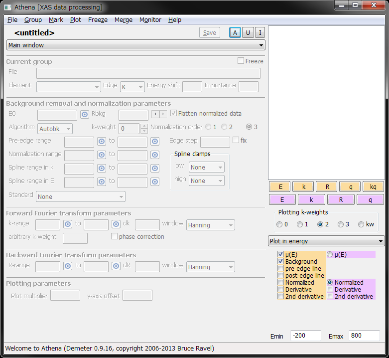

   Athena メインウィンドウ

.. note::

    以降のスクリーンショットでは少し古い版の Demeter に基づいていますが，最新版を利用してください．

プラグインの有効化
------------------

Athena は Photon Factory, SPring-8, SAGA-LS, あいち SR で測定した XAFS データを同梱されたファイル読み込み用のプラグインを有効化することで読み込むことができる．以下の手順で，プラグインの有効化を行うこと．

操作
~~~~

1. Athena を起動する．
2. Athena メインウィンドウの左上の "Main Window" と書かれているところを左クリックして，"Plugin registry" をクリックする．
3. メインウィンドウ左側のプラグイン一覧から PFBL12C の横のチェックボックスにチェックを入れ，左下の "Return to main window" をクリックする．

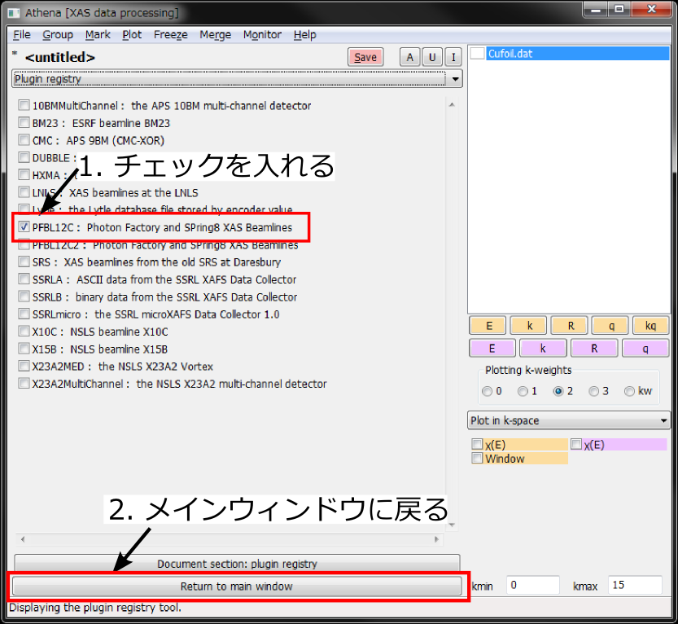

   Plugin registry

これで PFBL12C.pm プラグインが有効化され，Photon Factory, SPring-8 等で測定したデータを読み込める状態になる．

測定データの読み込み
--------------------

操作
~~~~

1. メニューバーの "File" から "Import data" を選択し，配布ファイル中にある Cufoil.dat を選択して，"Open" をクリックする．

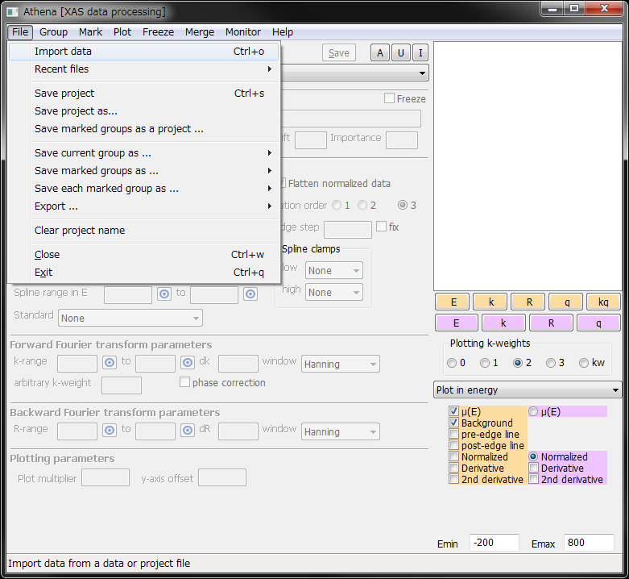

   データの読み込み

Cufoil.dat は透過法で測定された銅箔の Cu K-edge XAFS スペクトルデータである．

ファイルを Open した後に表示されるウィンドウ
--------------------------------------------

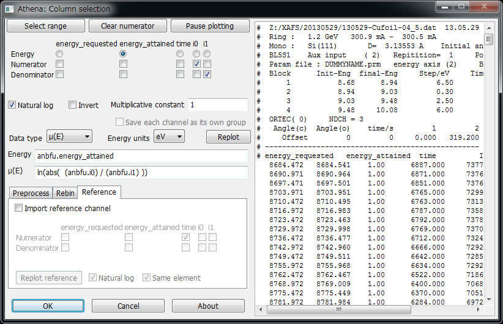

   読み込みオプション

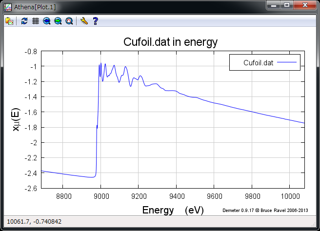

   読み込まれたデータの表示

読み込みオプションの意味
------------------------

Energy
    X 線エネルギー．分光器の角度エンコーダの値から計算したエネルギーを用いるため， **energy_attained** を選択する．
Numerator
    分子．透過法の場合は "i0" をチェック．
Denominator
    分母．透過法の場合は "i1" をチェック．
Natural log
    吸収スペクトルを計算する際に自然対数を取るか？透過法の場合はチェック．
Data type
    Athena
    内部でどういうデータと見なすか？\ |mu|\ (E)になっていることを確認する．

Energy にどちらを選択するべきか？
~~~~~~~~~~~~~~~~~~~~~~~~~~~~~~~~~

Energy に対しては，energy_requested と energy_attained のいずれかを選択することができる．energy_requested は XAFS 測定時に分光器を動かす際に目標位置，energy_attained は分光器の接続されている角度エンコーダの位置から計算されたエネルギーに対応している．通常，XAFS 測定前に角度エンコーダの較正を行うので，Energy には **energy_attained** を選択する．

.. note::

    energy_requested や energy_attained は，先に有効化した PFBL12C プラグイン固有の表現です．

読み込まれたデータ
------------------

操作
~~~~

1. 読み込みオプションウィンドウの OK をクリックする．

読み込みオプションウィンドウの OK をクリックしてデータを読み込むと，プロットウィンドウに以下のように表示される．

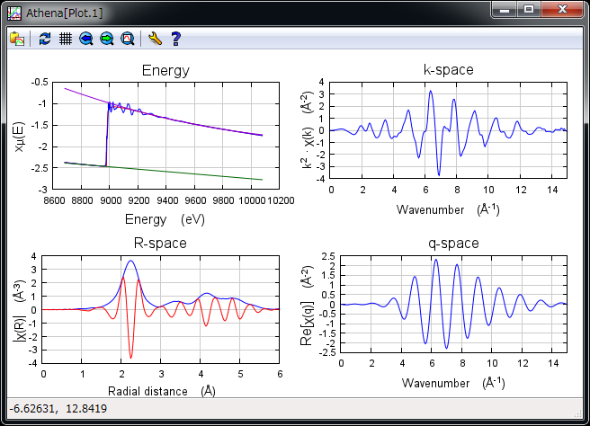

   Athena の既定のパラメータで解析された結果が自動的に表示される

メインウィンドウの説明 (プロット)
---------------------------------

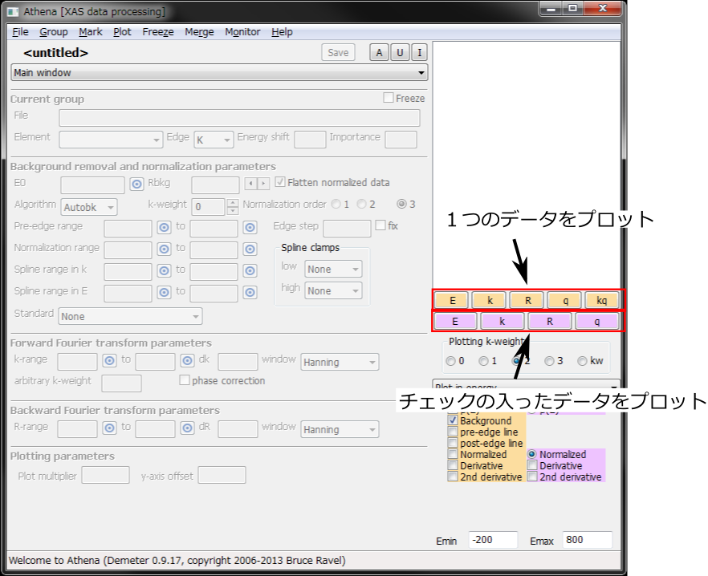

   メインウィンドウ（プロット）

オレンジ色のボタンでそれぞれ右上のデータ欄で選択されているデータをプロットすることができる．5つあるそれぞれのボタンをクリックすることで，以下に対応したグラフがプロットされる．

E
    エネルギーに対して XAFS をプロット

以下は後述

k
    波数に対して EXAFS 振動をプロット
R
    フーリエ変換後の EXAFS スペクトルをプロット
q
    逆フーリエ変換後の EXAFS 振動をプロット
kq
    元の EXAFS 振動と逆フーリエ変換後の EXAFS 振動を重ねてプロット

エネルギーに対して XAFS をプロット
----------------------------------

操作
~~~~

1. エネルギーに対して XAFS スペクトルをプロットするには以下のオレンジ色の E のボタンをクリックする

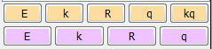

   プロット用のボタン

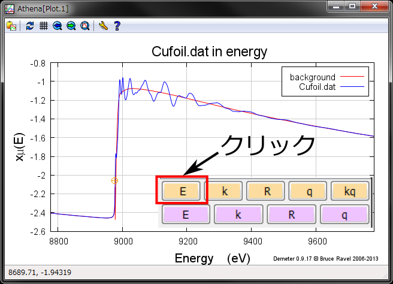

   エネルギーに対して XAFS をプロット

プロットウィンドウでのグラフの拡大
----------------------------------

プロットウィンドウに表示されたグラフは長方形の範囲を指定することで拡大することができる．

操作
~~~~

1. プロットウィンドウ上の拡大したい範囲の長方形の1つの角で右クリックする
2. そのまま，適当な範囲までカーソルを動かす
3. 拡大したい範囲が選択されたら，右クリックする

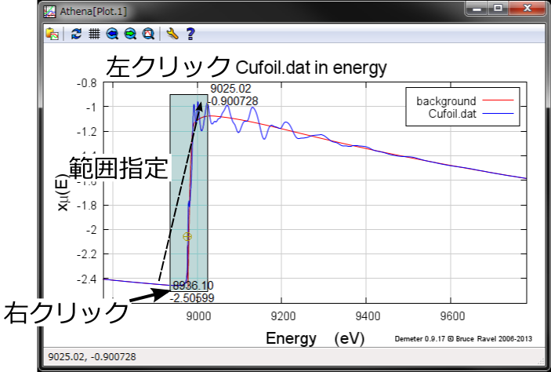

   プロットの拡大方法

**元の大きさでプロットしたい場合はプロット用のボタンを再度クリックする．**

   プロット用のボタン

XAFS スペクトルの用語のおさらい
-------------------------------

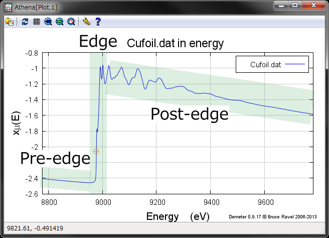

   XAFS スペクトルの用語

Pre-edge（プレエッジ）
    吸収端の前の領域
(Absorption) Edge
    吸収端（X線の吸収量が急激に大きくなるところ）
Post-edge（ポストエッジ）
    吸収端の後の領域

Athena による XAFS データ処理の流れ
-----------------------------------

1. バックグラウンド吸収である Pre-edge 領域を「直線」でフィッティングして，実験値から差し引く
2. Post-edge 領域を「多項式」でフィッティングして，XAFS スペクトルを「規格化」する（Athena の場合は「多項式」として0次関数（定数），一次関数（直線），二次関数を選択することができる）
3. 「スプライン曲線」でフィッティングして，EXAFS 振動を抽出する
4. EXAFS 振動をフーリエ変換して，原子間距離に関係のあるピークを示すスペクトルを得る

.. note::

    Pre-edge 領域のバックグラウンドについて，他の XAFS 解析ソフトでは直線ではなく，経験的な X 線質量吸収係数の近似式である Victoreen の式を用いる場合があるが，Athena の作者によると，後述の Debye-Waller 因子の値がわずかに変わるだけで本質的な違いは無いとされています．

なぜ規格化を行うのか？
~~~~~~~~~~~~~~~~~~~~~~

透過法による XAFS 測定を考えると，対象元素の吸収端エネルギーでの吸収変化量は X 線光路上にある対象元素の量に対応しているはずである．試料は，単位面積あたりの対象元素の量を考えて調製されるが，厳密な量ははっきりしていないことも多い．そこで，吸収端の吸収量を1に規格化することで，単位対象元素量に対するスペクトルを得る．

バックグラウンド処理
--------------------

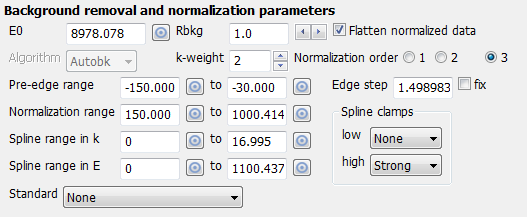

   バックグラウンドパラメータ

**Background removal and normalization parameters** の欄では，スペクトルのバックグラウンドや規格化に関するパラメータを設定する．

バックグラウンド処理のパラメータ
--------------------------------

E0
    「吸収端」の値 **（Athena は吸収スペクトルの立ち上がりの一次微分の極大値を自動的に E0 に設定する）**
Pre-edge range
    プレエッジ（吸収端より前）のバックグラウンドを引くのに使うデータの範囲(E0に対する相対値)

以下は後述

Normalization range
    ポストエッジの規格化用の関数を引くときに使うデータの範囲（E0に対する相対値）
Normalization order
    ポストエッジの規格化用の関数を引くときに何次の多項式を使うか
Rbkg
    バックグラウンド関数を引くときに使うパラメータの1つ
k-weight
    バックグラウンド関数を引くときに使うパラメータの1つ
Spline range in k
    バックグラウンド関数を引くときに使うデータ範囲を E0 に対する波数 k で指定したもの
Spline range in E
    バックグラウンド関数を引くときに使うデータ範囲を E0 に対するエネルギー E で指定したもの
Edge step
    吸収端のジャンプの値
Spline clamps
    バックグラウンド関数を引くときに使うパラメータの1つ
Standard
    バックグラウンド関数を引くときの基準になる標準データの設定（通常，使わない）

EXAFS 振動を抽出する時に考えること
----------------------------------

X線吸収スペクトルについて，大まかに考えると，以下の様な式で表現することができる．

.. math::
   
   \mu(E) = \mu_0(E) \times (1 + \chi(E))

:math:`\mu(E)`
    吸収スペクトル
:math:`\mu_0(E)`
    単純な原子のX線吸収スペクトル
:math:`\chi(E)`
    X線吸収により飛び出した光電子と近接原子の相互作用による吸収スペクトルの変化．すなわち， **EXAFS**\ ！

この式を EXAFS 振動 :math:`\chi(E)` について変形すると，

.. math::
   
   \chi(E) = (\mu(E) - \mu_0(E)) / \mu_0(E)

となる．但し， **Athena では** :math:`\mu_0(E)` ではなく，:math:`\mu_0(E_0)` を使う．すなわち，

.. math::
   
   \chi(E) = (\mu(E) - \mu_0(E)) / \mu_0(E_0)

つまり，:math:`\mu_0(E)` と :math:`\mu_0(E_0)` を計算することで :math:`\chi(E)` を求めることができる

ここで，

:math:`\mu_0(E)`
    単純な原子のX線吸収スペクトル
:math:`\mu_0(E_0)`
    吸収端のジャンプ

であるため，これらを求めるために以下の手順で解析を行う．

プレエッジの引き方
------------------

デフォルトのパラメータで引かれているプレエッジを表示するにはプロットボタン "E" をクリックして，エネルギーに対する XAFS を表示している状態で，メインウィンドウ右下の pre-edge line のチェックボックスを入れる．こうすると，現在のプレエッジが緑色の線としてプロットウィンドウに表示される．

操作
~~~~

1. エネルギーに対して XAFS スペクトルをプロットするにはオレンジ色の E のボタンをクリックする
2. エネルギーに対する XAFS を表示している状態で，メインウィンドウ右下の pre-edge line のチェックボックスを入れる

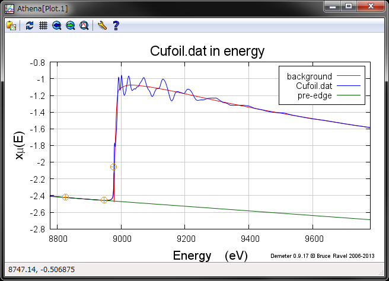

   プレエッジ

Athena でのプレエッジは前述の通り「直線」で引かれるため，単にどの範囲のデータ点を利用して近似直線を引くかという Pre-edge range というパラメータしかない．既定では吸収端 E0
のエネルギーからの相対値で -150 eV から -30 eV の範囲のデータ点を利用する．

プレエッジの引き方について
~~~~~~~~~~~~~~~~~~~~~~~~~~

透過法による XAFS スペクトルに対してはほとんどの場合，既定のパラメータで問題のないプレエッジを引くことができる．但し，例えば，Pd などの比較的重い元素の場合はプレエッジの指定範囲を -250 から -60 eV 程度にした方が適切な場合もある．

一方，蛍光法による測定の場合には直線で引くのが困難な場合がある．基本的な目安としては，吸収端前後で全体としてのスペクトルの傾きが近くなるように引くということが考えられるが，経験によるところも大きい．

規格化の引き方
--------------

ポストエッジはプロットボタン "E" をクリックして，エネルギーに対する XAFS を表示している状態で，メインウィンドウ右下の post-edge line のチェックボックスを入れると，紫色の線としてプロットウィンドウに表示される．

操作
~~~~

1. エネルギーに対する XAFS を表示している状態で，メインウィンドウ右下の post-edge line のチェックボックスを入れる

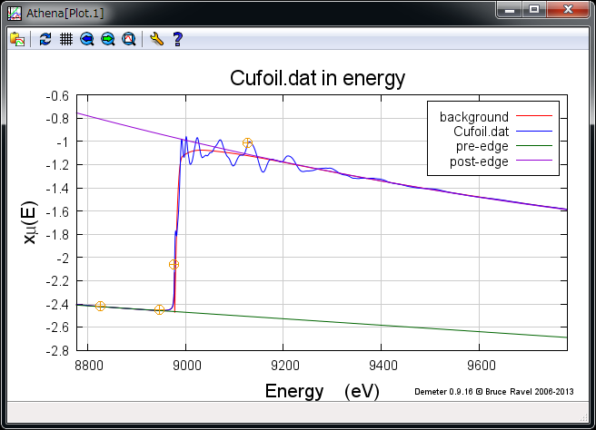

   ポストエッジ（プレエッジも表示）

Athena でのポストエッジは前述の通り「多項式」で引かれるため，どの範囲のデータ点を利用して近似曲線を引くかという Post-edge range および Normalization order という2種類のパラメータが存在する．

Normalization range
    規格化を行うために使うデータの範囲(E0に対する相対値)
Normalization order
    ポストエッジのバックグラウンド関数を引く際に何次の多項式を使うか

配布した Cufoil.dat の場合は吸収端 E0 のエネルギーからの相対値で 150 eV から 1000 eV 程度の範囲のデータ点を利用する．高エネルギー側をどの範囲まで取るかはデータに応じて適当な値が設定される．

この時，吸収端付近で紫色の線が振動の中心から外れている．このため，例えば，低エネルギー側の範囲を 50 eV，高エネルギー側の範囲を 1100 eV に変更すると，ポストエッジの線が吸収端に近いエネルギー範囲でも振動の中心を通るようになる．また，高エネルギー側の末端もデータが存在する 1100 eV に変更しておく．

.. note::

   Normalization order はデフォルトの 3 でよいことが多い．しかし，測定範囲が狭いデータに対しては，2 をとるとよいこともある．

操作
~~~~

1. **Background removal and normalization parameters** の欄の Normalization range を 50 to 1100 に変更する
2. エネルギーに対して XAFS スペクトルをプロットするためにオレンジ色の E のボタンをクリックする

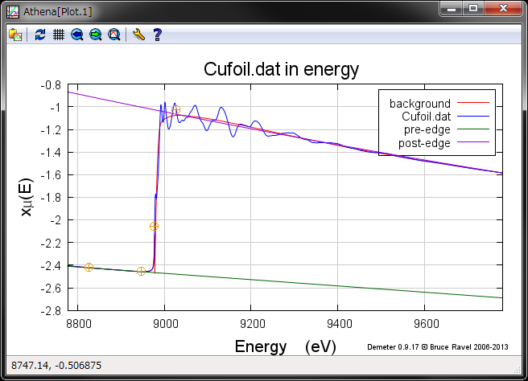

   ポストエッジ変更後

ポストエッジの引き方の目安
~~~~~~~~~~~~~~~~~~~~~~~~~~

ポストエッジについては，できるだけ EXAFS 振動の「真ん中」を通るように引く必要がある．但し，吸収端直後 +50 eV 程度の振動の中心まで通るようにする必要はない．なぜならば，+50 eV 程度までの範囲では，隣接原子の散乱による効果以外に他の複雑な効果（「多重散乱」）も入っており，正弦波的な変動以外の成分も存在するためである．また，通常，この領域は EXAFS 解析には利用しない．吸収端直後の振動の中心よりも，+50 eV より高エネルギー側について振動の中心を通っていることを優先する必要がある．

ここまでのバックグラウンドパラメータ
------------------------------------

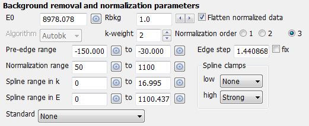

   バックグラウンドパラメータ

規格化された XAFS スペクトルの表示
----------------------------------

プロットボタン "E" をクリックして，エネルギーに対する XAFS を表示している状態で，メインウィンドウ右下の Normalized のチェックボックスにチェックを入れると，ここまでで決定したプレエッジとポストエッジを用いて規格化された XAFS スペクトルがプロットウィンドウに表示される．

操作
~~~~

1. エネルギーに対して XAFS スペクトルをプロットするためにオレンジ色の E のボタンをクリックする
2. エネルギーに対する XAFS を表示している状態で，メインウィンドウ右下の Normalized のチェックボックスにチェックを入れる

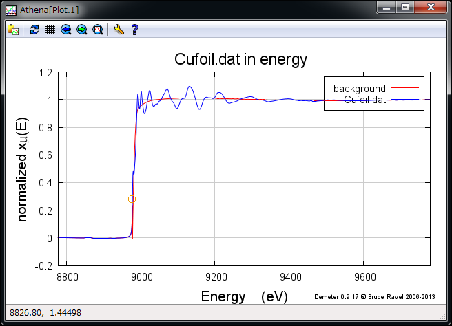

   規格化（およびフラット化）された XAFS スペクトル

**但し，この時に表示されている規格化された XAFS スペクトルは，「真の」規格化された XAFS スペクトルとは異なる．**

通常は，メインウィンドウの **Background removal and normalization parameters** の欄にある "Flatten normalized data" のチェックボックスにチェックが入っている．ここにチェックが入っている場合，Athena は吸収端より高エネルギー側について，規格化されたスペクトルからプレエッジの線とポストエッジの線の差分を差し引いたスペクトルを表示する．結果的に XAFS スペクトルの吸収が 1 になるように「フラット化」される．但し，"Flatten normalized data" は EXAFS スペクトルの抽出には影響を与えず，エネルギーに対して XAFS をプロットする時だけに適用される．"Flatten normalized data" のチェックを外して，以下の様な「真の」規格化された XAFS スペクトルがプロットされる．

操作
~~~~

1. メインウィンドウの **Background removal and normalization parameters** の欄にある "Flatten normalized data" のチェックボックスのチェックを外す
2. エネルギーに対して XAFS スペクトルをプロットするためにオレンジ色の E のボタンをクリックする

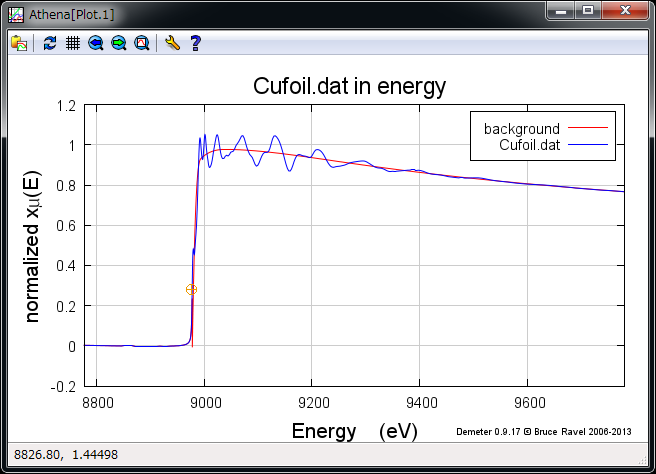

   「真の」規格化された XAFS スペクトル

EXAFS 振動の抽出
----------------

ここまでは，「プレエッジ」と「ポストエッジ」を引くことにより，スペクトルの前処理を行った．次に EXAFS 振動を抽出するために「バックグラウンド」=「原子のみのX線吸収スペクトルの近似曲線」=「スプライン曲線」を引く．

「スプライン曲線」は、`Autobk <http://cars.uchicago.edu/~newville/autobk/ProgramDoc/>`__ というライブラリ（プログラム）を利用して求められる．詳細は Autobk のアルゴリズムを理解する必要があるが，通常は Spline range を適当な範囲に設定するのみでよい．その他に Rbkg，Spline clamp，k-weight などのパラメータはごく簡単に説明する．

Spline range とは
-----------------

Spline range in k
    k (波数) を基準に指定するスプライン関数を引く際に利用するデータ点の範囲
Spline range in E
    E (エネルギー) を基準に指定するスプライン関数を引く際に利用するデータ点の範囲

Spline range in k および Spline range in E は互いに連動しているので，ここでは，エネルギーを基準としてデータ範囲を指定する Spline range in E のみを説明する．k の意味については，後述している．

これまでプロットウィンドウ上で赤い線で background として表示されていた線がスプライン関数である．例えば，配布ファイルの Cufoil.dat を読み込んだ場合は，デフォルトで 0 からおよそ 1100.4 eV に設定される．

試料によっては，吸収端から 1000 eV 以上高エネルギー側の領域において，EXAFS 振動に由来するスペクトルの変動に対して，ノイズによるスペクトルの変動が同程度あるいはより大きくなってしまうことがある．その場合，ノイズの変動に引きずられて，「原子のみのX線吸収スペクトルの近似曲線」と期待される曲線とは全く違う曲線になってしまうことがある．その場合，ノイズの影響が強い領域を無視するために，Spline range を狭めることがある．

配布データにおいて，Spline range を大きく変更する必要があるスペクトルはないが，以下に Spline range を実際に変更して，その影響を示す．

操作
~~~~

1. **Background removal and normalization parameters** の欄の Spline range を 0 to 500 に変更する
2. エネルギーに対して XAFS スペクトルをプロットするためにオレンジ色の k のボタンをクリックする

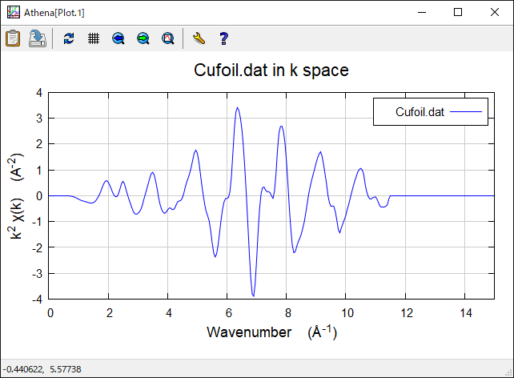

   Spline range 500 eV までにした場合の EXAFS スペクトル

このように，k (波数) で 11.5 程度の範囲までしか「原子のみのX線吸収スペクトルの近似曲線」が計算されないため，EXAFS スペクトルもこの範囲で抽出される．この後の解析のために，Spline range を 0 - 1100 eV に戻しておく．

操作
~~~~

1. **Background removal and normalization parameters** の欄の Spline range を 0 to 1100 に変更する
2. エネルギーに対して XAFS スペクトルをプロットするためにオレンジ色の k のボタンをクリックする

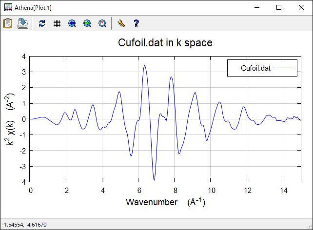

   Spline range 1100 eV までにした場合の EXAFS スペクトル

Spline range にどのような値を取るべきか
~~~~~~~~~~~~~~~~~~~~~~~~~~~~~~~~~~~~~~~

Spline range はデフォルトで設定される値で問題ないことがほとんどである．但し，例えば，蛍光法で測定した XAFS スペクトルにおいて，高エネルギー側の領域でノイズの影響がひどく，デフォルトで設定される Spline range が適切でないことがある．その場合は，Spline range の高エネルギー側の値を，例えば 100 eV ずつ小さくして，得られる EXAFS 振動が極端にゆがんでいないことを確認すべきである．

Rbkg とは
---------

Rbkg
    バックグラウンド関数を引くときに使うパラメータの1つ

Rbkg の挙動についてはバックグラウンド関数を引く際に利用される `Autobk <http://cars.uchicago.edu/~newville/autobk/ProgramDoc/>`__ のアルゴリズムを理解する必要があるが，今回は Rbkg の値を実際に大きく変えてみることで，バックグラウンド関数への影響について簡単に理解する．

Rbkg の影響は，EXAFS スペクトル，特にフーリエ変換後の EXAFS スペクトルを見ることでよくわかる．このため，話が前後するが，次に EXAFS 振動 :math:`\chi(k)` およびフーリエ変換後の EXAFS スペクトルのプロットの仕方について，簡単に説明する．

波数に対して EXAFS 振動をプロット
---------------------------------

操作
~~~~

1. EXAFS 振動 :math:`\chi(k)` をプロットするには，以下オレンジ色の k
   のボタンをクリックする

   プロット用のボタン

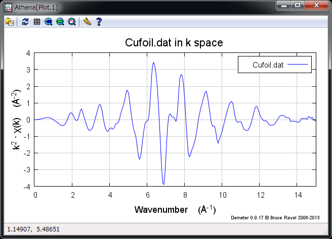

   波数に対して EXAFS 振動をプロット

フーリエ変換後の EXAFS スペクトルをプロット
-------------------------------------------

EXAFS 振動をフーリエ変換することで，原子間距離に応じたピークを示すスペクトルを得ることができる．

操作
~~~~

1. フーリエ変換後の EXAFS スペクトルをプロットするには，以下のオレンジ色の R のボタンをクリックする

   プロット用のボタン

   フーリエ変換後の EXAFS スペクトルをプロット

Rbkg の効果
-----------

Rbkg の値を変えることで，「フーリエ変換後の EXAFS スペクトルの横軸について設定値以下のピークが極力小さくなるように」バックグラウンドを引くことができる．

例えば，既定値の 1 である場合には以下の様なバックグラウンドが引かれている．

操作
~~~~

1. エネルギーに対して XAFS スペクトルをプロットするためにオレンジ色の E のボタンをクリックする
2. エネルギーに対する XAFS を表示している状態で，メインウィンドウ右下の pre-edge, post-edge, Normalized のチェックボックスのチェックを外す

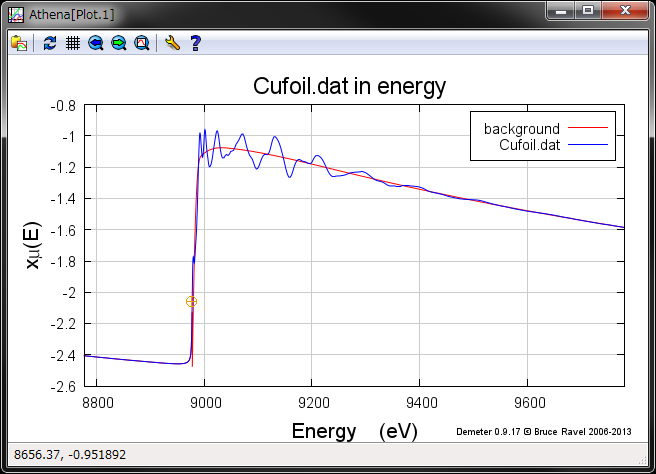

   Rbkg が既定値である 1 の場合

この時，フーリエ変換後の EXAFS スペクトルを表示すると，以下の様に「ふつうの」EXAFS
スペクトルが表示される．

操作
~~~~

1. フーリエ変換後の EXAFS スペクトルを表示するためにオレンジ色の R のボタンをクリックする

   Rbkg が既定値である 1 の場合

ここで，Rbkg を 0.2 に変更すると，以下の様に振動の中心からずれた「硬い」バックグラウンドが引かれてしまう．

操作
~~~~

1. メインウィンドウの **Background removal and normalization parameters** の欄にある Rbkg の値を 1 から 0.2 に変更する
2. エネルギーに対して XAFS スペクトルをプロットするためにオレンジ色の E のボタンをクリックする

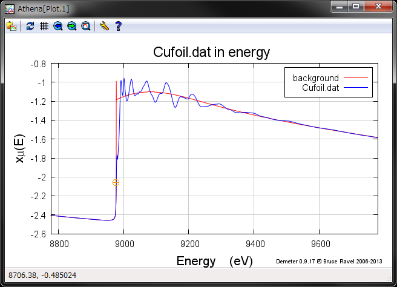

   Rbkg を 0.2 に変更した場合

また，フーリエ変換後の EXAFS スペクトルを表示すると，以下の様に 0.2 - 0.6 |angstrom| あたりに明らかにおかしなピークが出現する．（X 線を吸収した原子から 0.6 |angstrom| 以内に他の原子が存在しているとは考えられない）

操作
~~~~

1. フーリエ変換後の EXAFS スペクトルを表示するためにオレンジ色の R のボタンをクリックする

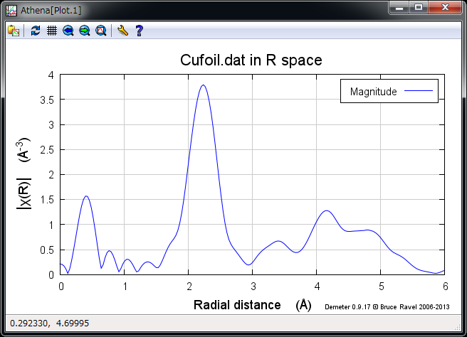

   Rbkg を 0.2 に変更した場合のフーリエ変換後の EXAFS スペクトル

逆に，Rbkg を 3.0 に変更すると，スペクトルは以下の様に表示される．

操作
~~~~

1. メインウィンドウの Background removal and normalization parameters の欄にある Rbkg の値を 0.2 から 3.0 に変更する
2. エネルギーに対して XAFS スペクトルをプロットするためにオレンジ色の E のボタンをクリックする

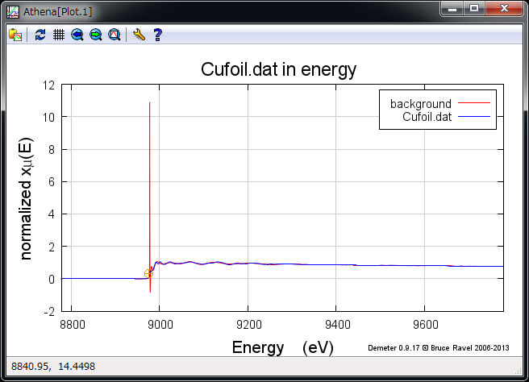

   Rbkg を 3.0 に変更した場合

バックグラウンド関数の影響でスペクトルがうまく表示されないので，例えば，吸収端より高エネルギー側を拡大すると以下の様に表示される．

操作
~~~~

1. プロットウィンドウ上の拡大したい範囲の長方形の1つの角で右クリックする
2. そのまま，適当な範囲までカーソルを動かす
3. 拡大したい範囲が選択されたら，右クリックする

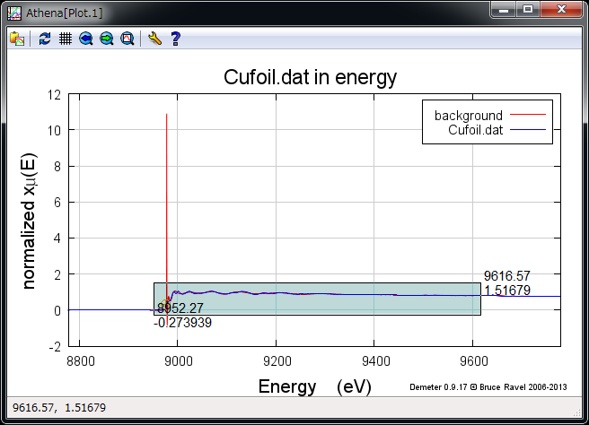

   Rbkg を 3.0 に変更した場合（吸収端直後の拡大範囲の設定）

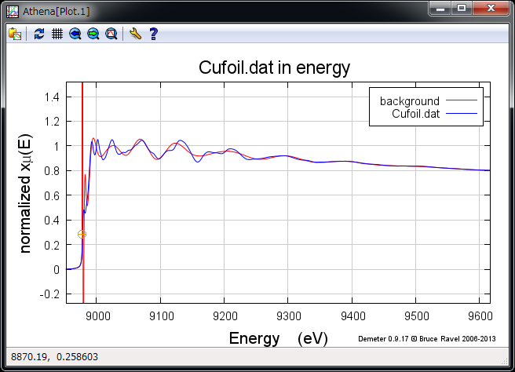

   Rbkg を 3.0 に変更した場合（吸収端直後の拡大図）

Rbkg の値を大きくすると，バックグラウンド関数が\ **元のスペクトルに強く追随している**\ ことがわかる． また，フーリエ変換後の EXAFS スペクトルを表示すると，Rbkg が 1.0 であった時とは明らかに異なるスペクトルが得られる．

操作
~~~~

1. フーリエ変換後の EXAFS スペクトルを表示するためにオレンジ色の R のボタンをクリックする

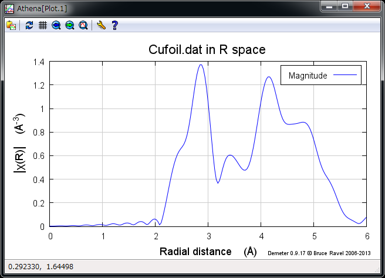

   Rbkg を 3.0 に変更した場合のフーリエ変換後の EXAFS スペクトル

すなわち，Rbkg の値はバックグラウンド関数（スプライン関数）の「自由度」（どのくらい元のスペクトルに追随するか）を決め，基本的には「フーリエ変換後の EXAFS スペクトルの横軸について設定値以下のピークが極力小さくなるように」バックグラウンドを引くという設定パラメータである．

最後に Rbkg を 1.0 に戻しておく．

操作
~~~~

1. メインウィンドウの Background removal and normalization parameters の欄にある Rbkg の値を 3.0 から 1.0 に変更する
2. エネルギーに対して XAFS スペクトルをプロットするためにオレンジ色の E のボタンをクリックする

Rbkg にどのような値を取るべきか
~~~~~~~~~~~~~~~~~~~~~~~~~~~~~~~

繰り返しになるが，Rbkg の値は，「フーリエ変換後の EXAFS スペクトルの横軸について設定値以下のピークが極力小さくなるように」バックグラウンドを引くということを意味する．Rbkg の値を変える主な場合としては，以下の様な状況が考えられる．

フーリエ変換後の EXAFS スペクトルの 1 |angstrom| 以下にピークが見られる場合，このような位置に散乱原子が存在することはあり得ないので，「ゴーストピーク」と呼ぶことがある．\ **フーリエ変換後の EXAFS スペクトル**\ において\ **短い距離にピークが出現する**\ ということは， **EXAFS 振動に長周期の波が混ざっていること**\ に対応している．Rbkg の値を大きくすると，元のスペクトルに対して追随しやすくなる．このため，長周期のノイズの成分に追随しやすくなり，結果的に「ゴーストピーク」を消す効果がある．

スペクトルが十分きれいであれば，Rbkg の値を変更する必要はないことが多い． **個人的な経験では** Rbkg は（予想している構造から考えて）明らかな「ゴーストピーク」を除去するためだけに変更することが多い．\ **個人的な経験では** 基本的に 1.0 から変更することはなく，場合によっては 1.0 - 1.3 程度まで増やすことがある．（バックグラウンド関数を引くのに使われている Autobk ライブラリの作者 Matthew Newville 氏は，この値を最大でも想定されるピークの位置の半分にすることを推奨している．）繰り返しになるが，これらの例は何かを保証するものではない．基本的に Rbkg の値を大きく変える必要があるようなスペクトルは測定しなおした方がよいと思われる．

Spline clamp とは
-----------------

Spline clamp では "low" と "high" の項目について，"none", "slight", "weak", "medium", "strong" と "rigid" の6通りが選択できる．"low" と "high" はそれぞれバックグラウンド関数の始点付近と終点付近を示しており，大まかに言って「バックグラウンド関数をスペクトルの端にどの程度追随させるか」に対応している．すなわち，"high" を既定値の "strong" から "rigid" に変更すると，バックグラウンド関数がスペクトルの末端においてもより強く追随する．

今回のデータでは Spline clamp が強く影響するものがないため，ここでは説明はしない．

.. note::

   ジャンプが小さい場合に，Spline clamp "high" を None にすると，より確からしいバックグラウンド関数になることがある．

k-weight とは
-------------

k-weight は，大まかに言って「バックグラウンドを引く際に吸収端近くか高エネルギー側のどこを重視してバックグラウンド関数を引くか」というパラメータである．すなわち，k-weight
が 2 や 3 の場合は高エネルギー側を重視してバックグラウンド関数を引く（できるだけ高エネルギー側までうまく EXAFS 振動を抽出したい）のに対して，k-weight が 1 の場合は吸収端近くを重視してバックグラウンド関数を引く．

また，この k-weight は "Plotting k-weights" とは異なる．

今回のデータでは k-weight が強く影響するものがないため，ここでは説明はしない．

k-weight にどのような値を取るべきか
~~~~~~~~~~~~~~~~~~~~~~~~~~~~~~~~~~~

ほとんどの場合，k-weight が既定値の 2 で問題になることはなく，この値でうまくバックグラウンド関数を引くことができない場合は，スペクトルを再測定した方がよい可能性が高い．但し，ノイズの影響が強く，高エネルギー側の振動がほとんどノイズに埋もれてしまっている場合には，k-weight を 1 にすることで，うまくバックグラウンド関数を引けることがある．

EXAFS 振動の抽出
----------------

ここまでで，Background removal and normalization parameters にあるパラメータを変更して，スペクトルの前処理と EXAFS 振動を抽出するパラメータを決定したことになる．結果的に抽出された EXAFS 振動を表示すると，

操作
~~~~

1. 波数に対して EXAFS 振動をプロットするためにオレンジ色の k のボタンをクリックする

   波数に対して EXAFS 振動をプロット

となる．

k = wavenumber（波数） とは何か
-------------------------------

通常，EXAFS 振動をプロットする際には，エネルギーの軸に波数 :math:`k` を用いる．:math:`k` は飛び出した光電子のエネルギーに対応し，吸収端 :math:`E_0` を用いて以下のように表現される．

.. math::
   k = \sqrt{2m(E-E_0)/\hbar^2}

フーリエ変換
------------

EXAFS 振動をフーリエ変換することで，原子間距離に応じたピークを示すスペクトルを得ることができる．\ **Forward Fourier transform parameters** の欄では，EXAFS 振動をフーリエ変換する際のパラメータを設定する．

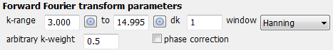

   フーリエ変換パラメータ

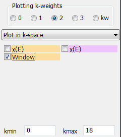

   EXAFS プロットオプション（メインウィンドウ右下）

フーリエ変換のパラメータ
------------------------

k-range
    窓関数の範囲
dk
    窓関数の傾きの範囲
window
    窓関数の種類 (Hanning でよい)
arbitrary k-weight
    k-weight を 0, 1, 2, 3 以外の任意の値にしたい場合に入力する
phase correction
    位相シフトの補正を行う（使わない）

フーリエ変換パラメータの決め方
------------------------------

EXAFS 振動から原子間距離に相当するところにピークを持つスペクトルを得るためにフーリエ変換を行う．この際の手順は，

1. 窓関数を決定する（窓関数に関するパラメータ k-range, dk, window を決定する）
2. フーリエ変換する（プロット用のボタンの R をクリックすることに相当する）

フーリエ変換の範囲を機械的にあるいは数学的に決めるのは難しい．（ノイズを定量的に評価して，範囲を決めることはできるかもしれない．）基本的には EXAFS 振動をみて，ノイズの影響が少ないと思われる範囲を設定する．（後述の例を参照）

操作
~~~~

1. 波数に対して EXAFS 振動をプロットするためにオレンジ色の k のボタンをクリックする
2. EXAFS プロットオプションの kmax を 18 に変更する
3. EXAFS プロットオプションの Window にチェックを入れる
4. EXAFS プロットオプションの Plotting k-weights を 3 に変更する

   EXAFS 振動を窓関数とともにプロット

窓関数について
~~~~~~~~~~~~~~

抽出された EXAFS 振動について，低エネルギー側の 0 - 2 :math:`\unicode{x212B}^{-1}` 付近は，エネルギーで示すと，0 - 35 eV 程度である．これは一般に複雑な過程である「多重散乱」の影響を受ける XANES 領域に当たる．また，高エネルギー側では，種々のノイズの影響により真の EXAFS 振動とは異なる変動が含まれてしまう．EXAFS 解析においては，これらの影響を無視する，すなわち，低エネルギー側およびノイズが含まれる領域を除いた部分だけをフーリエ変換するために，「窓関数」を利用する．

また，窓関数には通常 Hanning 関数が用いられることが多い．

フーリエ変換パラメータの影響
----------------------------

フーリエ変換パラメータは当然，フーリエ変換後の EXAFS スペクトルに影響を与える．以下ではそれぞれパラメータを変更して，フーリエ変換後の EXAFS スペクトルを表示することでその影響について理解する．

k-range を変更した場合
~~~~~~~~~~~~~~~~~~~~~~

操作
~~~~

1. k-range を 3 to 14.995 から 3 to 10 に変更する
2. フーリエ変換後の EXAFS スペクトルを表示するためにオレンジ色の R のボタンをクリックする

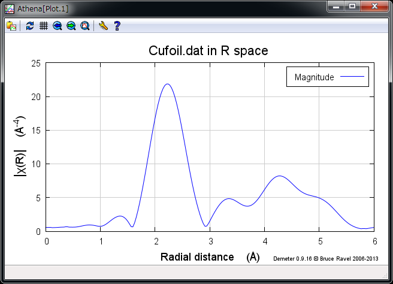

   k-range 3 to 10

k-range を狭くすると，全体的にピークの半値幅が広がってぼやけたスペクトルになる．

k-range を戻しておく．

操作
~~~~

1. k-range を 3 to 10 から 3 to 15 に変更する
2. フーリエ変換後の EXAFS スペクトルを表示するためにオレンジ色の R のボタンをクリックする

k-range にどのような値を取るべきか
~~~~~~~~~~~~~~~~~~~~~~~~~~~~~~~~~~

低エネルギー側は 3，高エネルギー側は「ノイズの影響が小さいと思われる範囲で」できるだけ大きな値を取るべきである．「ノイズの影響が小さいと思われる範囲」を機械的に決定することは難しく，経験によるところが大きい．対象としている試料について参照文献があり，EXAFS 振動とその k-range およびフーリエ変換後の EXAFS スペクトルが示されていれば，参考にするとよい．

.. note::
    
    後述の通り，比較したい複数の EXAFS スペクトルがある場合，同じ k-range でフーリエ変換を行う必要がある．

dk を変更した場合
~~~~~~~~~~~~~~~~~

操作
~~~~

1. dk を 1 から 0 に変更する
2. 波数に対して EXAFS 振動をプロットするためにオレンジ色の k のボタンをクリックする

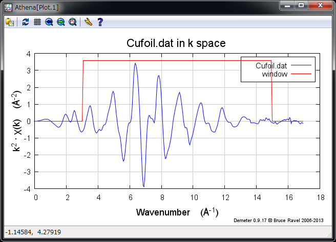

   dk = 0

このように，dk を 0 にすると，赤色の線で示されている Hanning 窓関数の傾きが無くなる．

操作
~~~~

1. フーリエ変換後の EXAFS スペクトルを表示するためにオレンジ色の R のボタンをクリックする

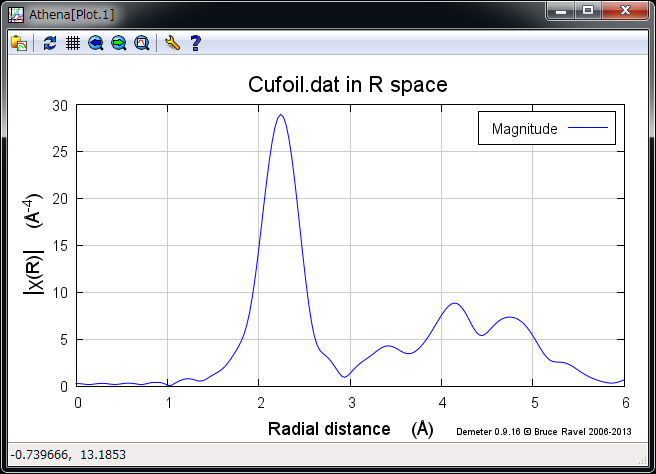

   dk = 0

操作
~~~~

1. dk を 0 から 1 に変更する
2. フーリエ変換後の EXAFS スペクトルを表示するためにオレンジ色の R のボタンをクリックする

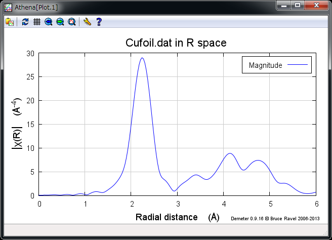

   dk = 1

このように，dk スペクトルの質がある程度よい場合には，フーリエ変換後の EXAFS スペクトルにあまり大きな影響を与えない．

dk にどのような値を取るべきか
~~~~~~~~~~~~~~~~~~~~~~~~~~~~~

基本的には既定値の 1 で問題ない．\ **個人的には** 0.5 程度の値を取ることもある．（M. Newville の推奨値は 0）

**比較したい一連のスペクトルについては，同じパラメータを用いる．**

データの追加読み込み
--------------------

Athena では同時に複数のスペクトルを処理することができる．

操作
~~~~

1. メニューバーの "File" から "Import data" を選択し，配布ファイル中にある Aufoil.xmu を選択して，"Open" をクリックする
2. 読み込みオプションウィンドウで，Numerator に xmu を選択する
3. 読み込みオプションウィンドウの OK をクリックする

.. note::
   
   .xmu は Athena から出力できるファイル形式の1つである．

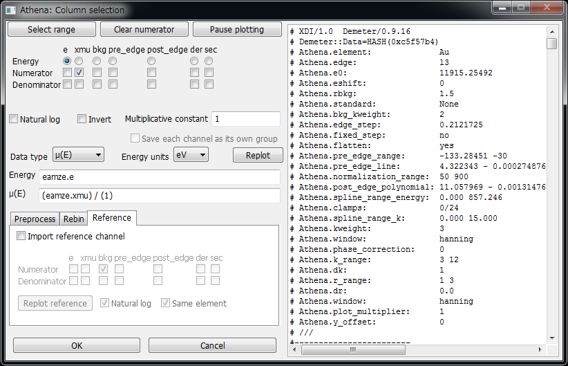

   Aufoil.xmu データの読み込み

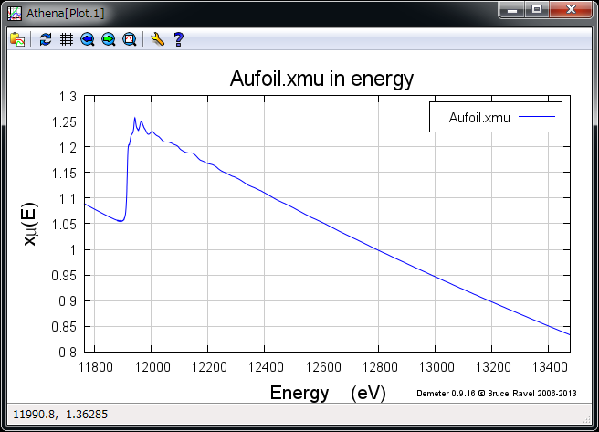

   Aufoil.xmu データの読み込み

操作
~~~~

1. メニューバーの "File" から "Import data" を選択し，配布ファイル中にある AuNPs.xmu を選択して，"Open" をクリックする
2. 読み込みオプションウィンドウの OK をクリックする

データを2つ読み込むとメインウィンドウでは以下のように表示される

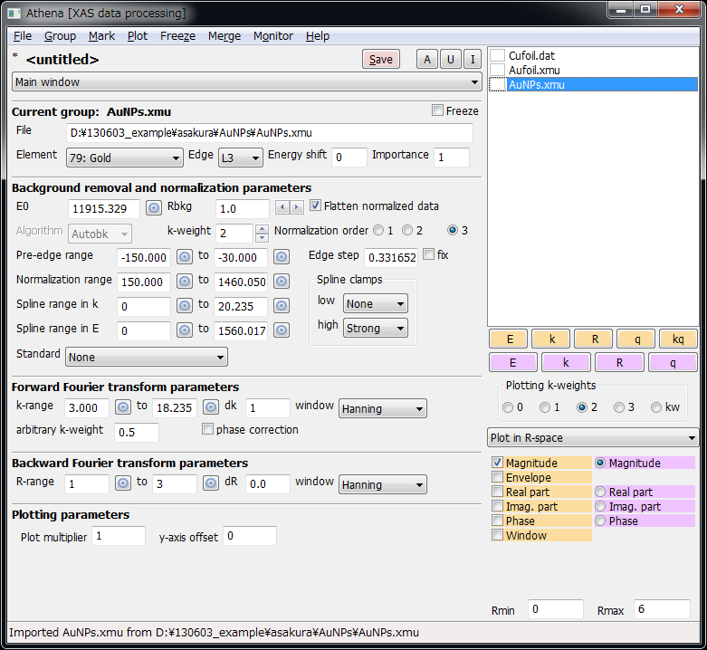

   3つのデータがインポートされたメインウィンドウ

複数データのプロット
--------------------

操作
~~~~

1. メインウィンドウ右上のデータ欄で Aufoil.xmu および AuNPs.xmu のチェックボックスにチェックをつける
2. 複数データプロット用ボタンの紫色の E をクリックする

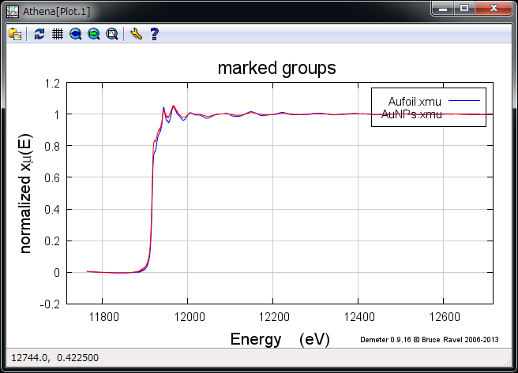

   Aufoil および AuNPs の重ね書き

特に，吸収端領域を表示する場合には，

操作
~~~~

1. メインウィンドウ右下の Emin, Emax を例えば，-40, 80 に変更する
2. プロット用ボタンの紫色の E をクリックする

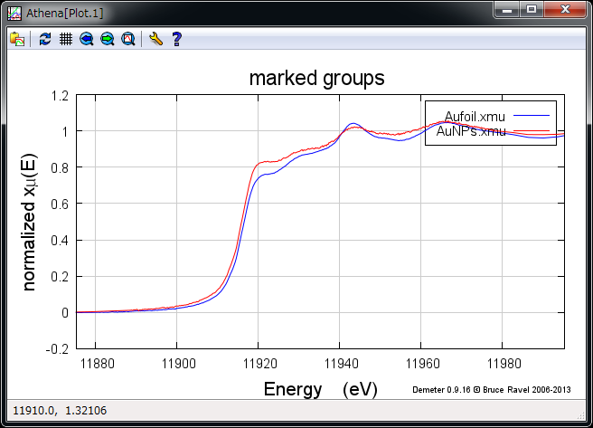

   Aufoil および AuNPs の XANES スペクトルの重ね書き

同様に EXAFS 振動についても以下のように表示することができる．

操作
~~~~

1. プロット用ボタンの紫色の k をクリックする
2. EXAFS プロットオプションの kmax を 20 に変更する
3. もう一度，プロット用ボタンの紫色の k をクリックする

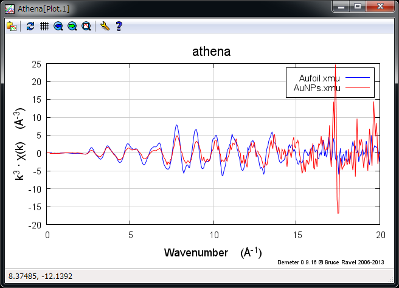

   Aufoil および AuNPs の EXAFS 振動の重ね書き

AuNPs の振幅が小さくなっているが，基本的には同じ振動構造を示していることがわかる．

Au 系データのパラメータの変更
-----------------------------

今回は **Background removal and normalization parameters** は既定値を使うこととする．

但し， **Forward Fourier transform parameters** については以下のように変更する．まずは，データ読み込み時のパラメータを確認する．

操作
~~~~

1. メインウィンドウ右上のデータ欄で Aufoil.xmu を選択する（青色で反転している状態にする）
2. 波数に対して EXAFS 振動をプロットするためにオレンジ色の k のボタンをクリックする
3. EXAFS プロットオプションの kmax を 20 に変更する
4. EXAFS プロットオプションの Window にチェックを入れる
5. EXAFS プロットオプションの Plotting k-weights を 3 に変更する

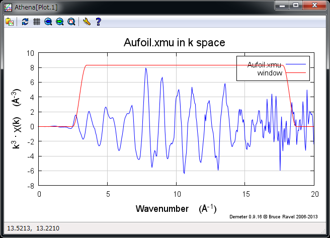

   Aufoil の EXAFS 振動

プロットを見ると，15 :math:`\unicode{x212B}^{-1}` 辺りからノイズが入り始め，16 :math:`\unicode{x212B}^{-1}` 以降はそれまでから予想されるスペクトルとは大きく異なっていることがわかる．そこで，ノイズと思われる領域を無視するために窓関数の範囲を変更する．

操作
~~~~

1. Forward Fourier transform parameters の k-range を 3 to 15 に変更する
2. 波数に対して EXAFS 振動をプロットするためにオレンジ色の k のボタンをクリックする

   Aufoil の EXAFS 振動

更に，フーリエ変換後の EXAFS スペクトルを表示すると，

操作
~~~~

1. フーリエ変換後の EXAFS スペクトルを表示するためにオレンジ色の R のボタンをクリックする

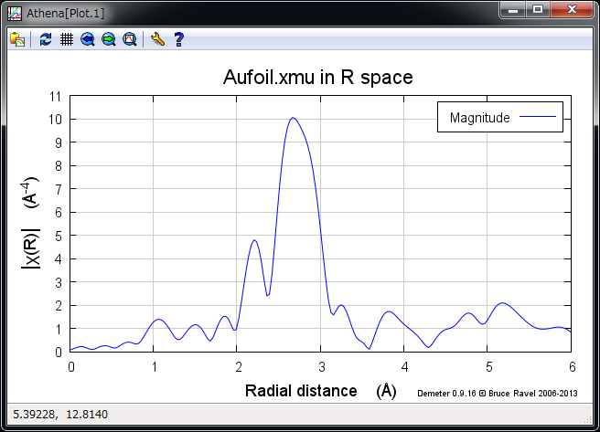

   Aufoil のフーリエ変換後 EXAFS スペクトル

となる．

次に，AuNPs についても，フーリエ変換範囲について確認する．

操作
~~~~

1. メインウィンドウ右上のデータ欄で AuNPs.xmu を選択する（青色で反転している状態にする）
2. 波数に対して EXAFS 振動をプロットするためにオレンジ色の k のボタンをクリックする
3. EXAFS プロットオプションの kmax を 20 に変更する
4. EXAFS プロットオプションの Window にチェックを入れる
5. EXAFS プロットオプションの Plotting k-weights を 3 に変更する

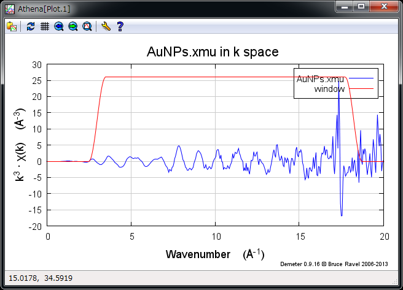

   AuNPs の EXAFS 振動

プロットを見ると，10 :math:`\unicode{x212B}^{-1}` 辺りからノイズが入り始め，16 :math:`\unicode{x212B}^{-1}` 以降はそれまでから予想されるスペクトルとは大きく異なっていることがわかる．そこで，ノイズと思われる領域を無視するために窓関数の範囲を変更する．

操作
~~~~

1. Forward Fourier transform parameters の k-range を 3 to 12 に変更する
2. 波数に対して EXAFS 振動をプロットするためにオレンジ色の k のボタンをクリックする

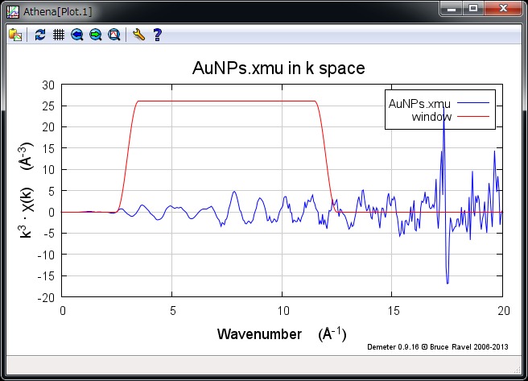

   AuNPs の EXAFS 振動

更に，フーリエ変換後の EXAFS スペクトルを表示すると，

操作
~~~~

1. フーリエ変換後の EXAFS スペクトルを表示するためにオレンジ色の R のボタンをクリックする

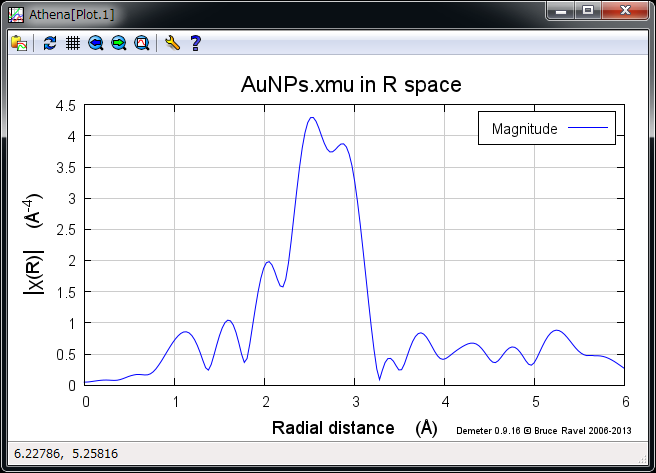

   AuNPs のフーリエ変換後の EXAFS 振動

となる．ここでは k-range の最大値を 12 にしたため，Aufoil.xmu とは様子が異なっているが，2.8 |angstrom| を中心とするピークを持つフーリエ変換後の EXAFS スペクトルが得られた．

ここで，\ **フーリエ変換には比較したい一連のスペクトルについて同じパラメータを使わなければならない**\ ことを思い出すと，k-range を同じに設定する必要がある．こういった場合は k-range について最も狭い範囲，今回の場合，3 - 12 :math:`\unicode{x212B}^{-1}` に合わせる．

操作
~~~~

1. メインウィンドウ右上のデータ欄で Aufoil.xmu を選択する（青色で反転している状態にする）
2. Forward Fourier transform parameters の k-range を 3 to 12 に変更する
3. メインウィンドウ右上のデータ欄で Aufoil.xmu および AuNPs.xmu のチェックボックスにチェックをつける
4. 複数データプロット用ボタンの紫色の R をクリックする

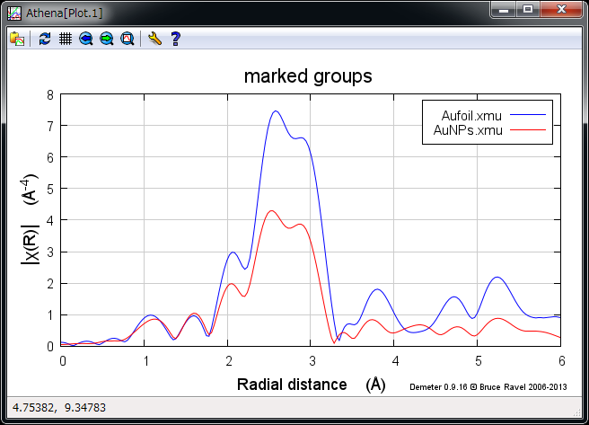

   Aufoil および AuNPs のフーリエ変換後の EXAFS スペクトルの重ね書き

最終的に，Aufoil および AuNPs のフーリエ変換後 EXAFS スペクトルにおいて，基本的に同じような形で AuNPs の方がピークが小さいという結果が得られた．

解析データの保存
----------------

次の Artemis の説明で必要なため，解析データを保存する．

操作
~~~~

1. メニューバーの File から Save project で適当な場所に .prj
   という形式で保存

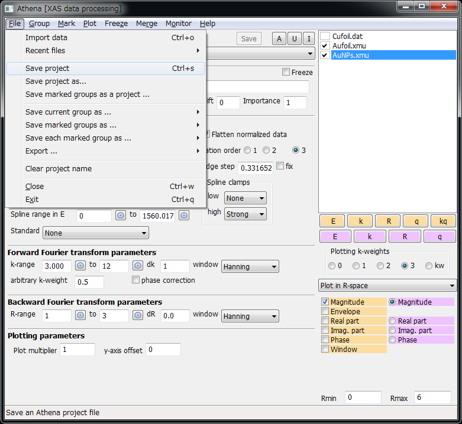

   Save project

保存が終わったら，一度 Athena を完全に閉じてから，Athena をもう一度起動し，保存したファイルが読み込めることを確認する．

操作
~~~~

1. Athena を終了する
2. Athena を起動する
3. メニューバーの File から Import data で保存した .prj ファイルを選択する

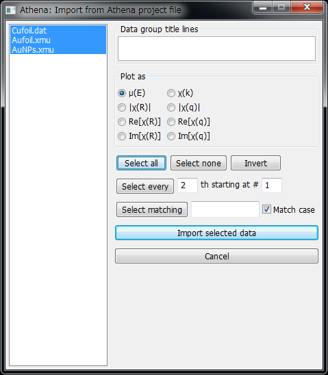

   解析データファイルを選択したところ

操作
~~~~

1. Select all で全てのデータを選択して Import selected data をクリック

元に戻っていることを確認する．

処理したデータのテキストデータ出力
----------------------------------

Athena で処理したデータはテキストデータとして出力することができる

操作
~~~~

1. 出力したいデータについて，メインウィンドウ右上のデータ欄でチェックを入れる
2. メニューバーの File から Save each marked group as をポイントする
3. 以下を参照して必要なデータを選択する
4. データを出力するフォルダを選択する

:math:`\mu(E)`
    元の XAFS スペクトル
norm(E)
    規格化後の XAFS スペクトル
:math:`\chi(k)`
    EXAFS スペクトル
:math:`\chi(R)`
    フーリエ変換後の EXAFS スペクトル
:math:`\chi(q)`
    逆フーリエ変換後の EXAFS スペクトル

出力されたデータのファイル形式については，ファイルをメモ帳などで開いて確認すること．
